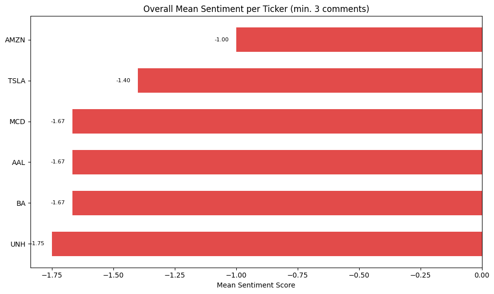
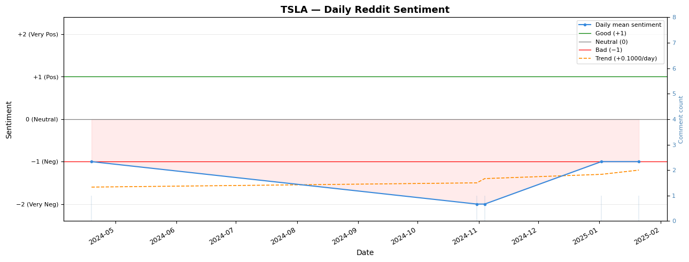
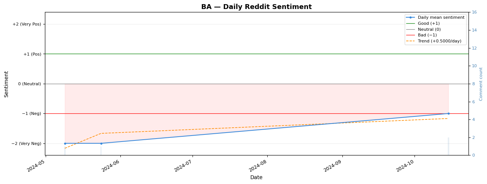

# 🦙 The LLAMA of WallStreet

### Reddit Stock Sentiment Analysis with LLMs
> Big Data Laboratory team project — Bologna Business School, 2026

An end-to-end pipeline that turns ~100k raw Reddit comments into a daily stock-sentiment signal, using a locally-hosted open-source LLM for structured information extraction — run at scale on the **Leonardo** supercomputer (CINECA).

## 📊 Overall Sentiment by Ticker

## 📈 Tesla (TSLA) Sentiment Trend

## 📈 Boeing (BA) Sentiment Trend

